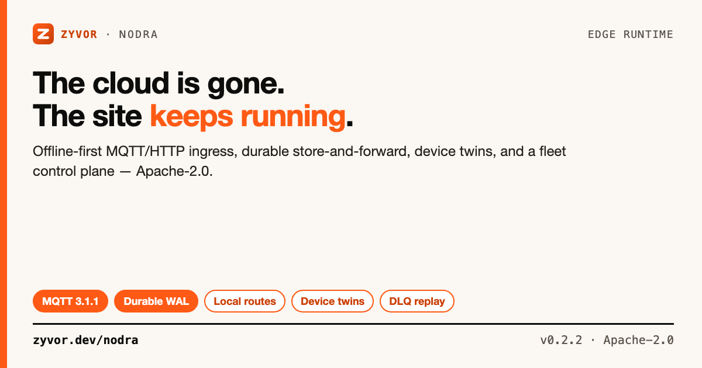

# Nodra

[](https://github.com/zyvorai/nodra/actions/workflows/ci.yml)
[](LICENSE)
[](CHANGELOG.md)



**The open edge runtime that keeps sites running when the cloud doesn't.**

📖 **[Read the full docs](https://zyvor.dev/docs/nodra)** — quickstart, architecture, security model, and production runbooks.

Nodra is an Apache-2.0 edge runtime and control plane from Zyvor. Remote sites get local MQTT/HTTP ingress, durable store-and-forward, local routes, device twins, edge app reconciliation, fleet health, replayable dead letters, and a clean web console. WAN loss is a first-class operating mode, not a degraded one.

## Contents

- [Why Nodra](#why-nodra)
- [Is this for you?](#is-this-for-you)
- [Capabilities](#capabilities)
- [Quick start](#quick-start)
- [Local routes](#local-routes)
- [Backpressure and disk protection](#backpressure-and-disk-protection)
- [Cloud routes and dead letters](#cloud-routes-and-dead-letters)
- [Device twins](#device-twins)
- [Certificate identity / mTLS](#certificate-identity--mtls)
- [Docker app reconciliation](#docker-app-reconciliation)
- [Kubernetes](#kubernetes)
- [Web console](#web-console)
- [CLI](#cli)
- [Architecture](#architecture)
- [Protocol strategy](#protocol-strategy)
- [Security defaults](#security-defaults)
- [Testing](#testing)
- [Docs](#docs)
- [License](#license)

## Why Nodra

Edge systems fail differently from datacenters. WAN links disappear, devices use several protocols, remote machines are hard to touch, and cloud-only automation becomes useless exactly when a site needs it most.

Nodra keeps the local path alive:

```text
PLC / sensor / app
        │
   MQTT or HTTP
        │
        ▼
      nodrad
        │
   ┌────┼─────────────┐
   │    │             │
 local  │         durable WAL
 route  │             │
   │    │             └─────► Nodra control plane when WAN returns
   ▼    ▼
 MES   local AI/app
```

## Is this for you?

Nodra is a small, open-source, offline-first edge runtime on a site's own hardware. It is not a no-code automation platform, not a managed cloud IoT service, and not a full HA platform today (file mode is one replica).

| | **Nodra** | Node-RED | EMQX/HiveMQ Edge | AWS IoT Greengrass | Azure IoT Edge |
|---|---|---|---|---|---|
| Primary scope | Edge ingress + durable store-and-forward + device twins + app reconciliation | Visual flow-based automation | MQTT broker (edge-deployed) | Cloud-connected edge runtime | Cloud-connected edge runtime |
| Cloud dependency | None required — WAN-loss is first-class | None required | Usually paired with a cloud broker/console | AWS IoT Core | Azure IoT Hub |
| License | Apache-2.0 | Apache-2.0 | Apache-2.0 core (EMQX) / proprietary (HiveMQ Edge) | Proprietary (free tier) | Proprietary (free tier) |
| Industrial protocols | Modbus TCP/RTU, J1939, OPC-UA, serial, NATS bridge (`docs/INDUSTRIAL_PROTOCOLS.md`) | Via community nodes | Not built-in | Via custom components | Via custom modules |
| HA / clustering | File mode: one replica. Postgres: revision-checked fleet state + concurrent delivery claims; full HA still open (`ROADMAP.md`) | N/A | Yes (broker clustering) | Managed by AWS | Managed by Azure |

*(General characterizations as of writing — verify against each project's own docs.)*

> **Maturity (honest):** v0.2.2 is a serious single-control-plane release. Four-hour lab soak passed 2026-09-21; 24h soak in progress (not signed until judged). 72h/7d, Nodra-built-in PITR, and the rest of the 1.0 gates remain open. Limits: [`docs/SCALE.md`](docs/SCALE.md). Upgrade: [`docs/UPGRADE.md`](docs/UPGRADE.md). If you need full HA today, this isn't there yet; if you need a single-site, offline-resilient edge runtime, this is the scope.

New here? [`docs/FAQ.md`](docs/FAQ.md) · [`docs/TROUBLESHOOTING.md`](docs/TROUBLESHOOTING.md)

## Capabilities

### Ingress

- **MQTT 3.1.1** — CONNECT, SUBSCRIBE, PUBLISH QoS 0/1/2 (exactly-once both ways), persistent sessions for queued QoS 1/2, local subscriber fan-out. Optional broker TLS and client certificates.
- **HTTP** — `POST /v1/publish` with optional local bearer protection.
- **Industrial** — Modbus TCP/RTU, J1939, OPC-UA, Linux serial, NATS subscribe bridge, Connector SDK.

### Durability

- **Offline-first WAL** — append-only, fsynced, replayed after restart, compacted automatically.
- **Explicit backpressure** — cap by bytes and event count; `reject`, `drop-oldest`, or `drop-newest`.
- **Local routes** — MQTT-style topic filters to local HTTP services while the WAN is down.
- **Transactional ACK** — server ACKs only after matching deliveries and the event are durably committed.
- **Dead-letter queue** — failed deliveries retain payload/history; inspect, replay, or delete.

### Fleet

- **Device twins** — desired state in the control plane, reported state from the edge, locally cached by `nodrad`.
- **Site identity** — optional CSR enrollment; private key stays on the edge. Self-rotation + X.509 CRL.
- **Fleet revocation** — revoked sites get a distinguishable `403 site_revoked`.
- **Edge app reconciliation** — Docker desired `running|stopped` state, env, ports, volumes, command.
- **Optional Postgres store** — revision-checked fleet reads and concurrent delivery claims (not a full HA claim).

### Ops

- Embedded Zyvor console (no CDN) with Overview, Sites, Devices, Streams, Apps, Dead letters, Logs.
- Optional OIDC SSO → admin/viewer roles; viewer/admin RBAC.
- Prometheus metrics; A–Z `nodra-sim` live fleet demo.
- Kubernetes-ready: Helm, Kustomize, Restricted Pod Security, non-root 65532.
- Supply chain: CodeQL, race tests, govulncheck, multi-arch OCI, SBOM, provenance, keyless cosign.

## Quick start

### Build

```bash
git clone https://github.com/zyvorai/nodra.git
cd nodra
make build
make ci                       # gofmt, vet, race tests, build
```

Binaries: `nodra-server`, `nodrad`, `nodractl`, `nodra-sim`, `nodra-relay-bridge`.

### Start the control plane

```bash
export NODRA_ADMIN_TOKEN='change-this-admin-token'
export NODRA_ENROLLMENT_TOKEN='change-this-enrollment-token'
export NODRA_ADMIN_USER='admin'
export NODRA_ADMIN_PASSWORD='change-this-admin-token'

./bin/nodra-server --listen :8080 --data ./data
```

Open `http://127.0.0.1:8080` and **Sign in**. Full demo path: [docs/DEMO.md](docs/DEMO.md).

### One-command Kubernetes demo

```bash
./scripts/demo-k8s.sh
# or: make demo-k8s
```

Sign in: `admin` / `nodra-demo-admin`. Teardown: `./scripts/demo-k8s.sh --uninstall`.

Compose alternative: `docker compose up --build`.

### Create an edge config

```bash
./bin/nodrad init \
  --config ./nodrad.json \
  --server http://127.0.0.1:8080 \
  --site factory-west \
  --enrollment-token "$NODRA_ENROLLMENT_TOKEN" \
  --data ./edge-data \
  --listen 127.0.0.1:9091 \
  --mqtt-listen 127.0.0.1:1883 \
  --max-spool-bytes 2147483648 \
  --max-spool-events 1000000 \
  --spool-policy reject

./bin/nodrad --config ./nodrad.json
```

### Publish

```bash
# HTTP
./bin/nodractl publish \
  --agent http://127.0.0.1:9091 \
  --topic factory/line-1/temperature \
  --data '{"c":31.2}'

# MQTT QoS 2
mosquitto_pub -h 127.0.0.1 -p 1883 \
  -t factory/line-1/temperature \
  -q 2 -m '{"c":31.2}'
```

Ports (`NODRA_PORT`, Helm NodePort, remote deploy, smoke): see [docs/OPERATIONS.md](docs/OPERATIONS.md).

## Local routes

Local routes live in `nodrad.json` and execute at the edge even if the WAN is down:

```json
{
  "local_routes": [
    {
      "name": "Local MES",
      "topic": "factory/+/telemetry",
      "target_url": "http://127.0.0.1:7070/events",
      "method": "POST",
      "timeout": "3s",
      "filter": {
        "exists": ["c"],
        "min": {"c": 0},
        "max": {"c": 80},
        "equals": {"status": "ok"},
        "in": {"line": ["1", "2"]}
      },
      "transform": {
        "set_headers": {"x-source": "nodra"},
        "drop_fields": ["raw"],
        "set_fields": {"unit": "C"},
        "wrap_as": "reading",
        "topic_rewrite": "mes/{{topic}}"
      }
    }
  ]
}
```

`filter` and `transform` are optional and evaluated per route at the edge — no scripting, just data. Cloud forwarding and local routing are independent. A local destination failure enters the agent's durable local-delivery WAL and retries with backoff.

## Backpressure and disk protection

```json
{
  "max_spool_bytes": 2147483648,
  "max_spool_events": 1000000,
  "spool_policy": "reject"
}
```

- `reject` — safest default. HTTP 507 / MQTT failure when the spool is full.
- `drop-oldest` — keep recent data at the cost of older data.
- `drop-newest` — preserve queued history and reject the new event.

## Cloud routes and dead letters

```bash
nodractl --server http://127.0.0.1:8080 --token "$NODRA_ADMIN_TOKEN" \
  routes create \
  --name analytics \
  --topic 'factory/+/telemetry' \
  --target https://analytics.example.com/edge

nodractl --token "$NODRA_ADMIN_TOKEN" dlq list
nodractl --token "$NODRA_ADMIN_TOKEN" dlq replay dlv_...
```

## Device twins

```bash
nodractl --token "$NODRA_ADMIN_TOKEN" twins desired plc-1 \
  --json '{"speed":1200,"mode":"auto"}'
```

`nodrad` caches desired twin state locally. Adapters report actual state:

```http
POST /v1/twins/plc-1/reported
Authorization: Bearer <local-token>
Content-Type: application/json

{"reported":{"speed":1198,"mode":"auto"}}
```

## Certificate identity / mTLS

```bash
nodra-server --pki --data /var/lib/nodra ...
nodrad init ... --request-certificate
```

The edge private key is generated locally and never leaves the site. Enforce mTLS with HTTPS + `--client-ca` and `--require-client-cert` / `NODRA_REQUIRE_CLIENT_CERT`. Bearer credentials remain supported for bootstrap.

## Docker app reconciliation

```bash
nodractl --token "$NODRA_ADMIN_TOKEN" deployments create \
  --site site_... \
  --name vision-worker \
  --version 2.1.0 \
  --image ghcr.io/example/vision:2.1.0 \
  --desired running
```

Run the agent with `runner: "docker"` (opt-in; not in the default Kubernetes agent manifest). Optional cosign verification via `signature_mode`; unhealthy deployments roll back after `deploy_health_grace`. See [`docs/SECURITY-MODEL.md`](docs/SECURITY-MODEL.md).

## Kubernetes

```bash
# Demo (kind + Helm + sim)
./scripts/demo-k8s.sh

# Demo Helm profile
helm upgrade --install nodra ./charts/nodra \
  --namespace nodra-demo --create-namespace \
  -f charts/nodra/values-demo.yaml \
  --set image.repository=ghcr.io/zyvorai/nodra --set image.tag=0.2.1

# Production-shaped (one replica, Postgres, cert-manager TLS)
helm upgrade --install nodra ./charts/nodra \
  --namespace nodra --create-namespace \
  -f charts/nodra/values-production.yaml
```

Create Secret `nodra-production` first ([docs/DEPLOYMENT.md](docs/DEPLOYMENT.md)). Helm defaults to one replica; file mode refuses `replicaCount > 1`. Postgres sharing is not a full HA claim.

Raw manifests: `deployments/kubernetes/`. Demo kustomize: `deployments/kustomize/demo`.

## Web console

Embedded static UI (no CDN):

| Tab | Contents |
|---|---|
| Overview | Fleet counts + live activity preview |
| Sites | Enrolled sites |
| Devices | Devices and twins |
| Streams | Cloud routes |
| Apps | Deployments and alerts |
| Dead letters | Replayable DLQ |
| Logs | Terminal-style activity stream |

## CLI

```text
nodractl status | status json | preflight | doctor
nodractl support-bundle --out DIR
nodractl overview | sites list | sites revoke SITE_ID
nodractl devices | twins list | twins desired DEVICE_ID --json '{}'
nodractl routes list|create|delete
nodractl deployments list|create
nodractl alerts list|resolve
nodractl dlq list|replay|delete
nodractl events | publish ...
```

## Architecture

See [docs/ARCHITECTURE.md](docs/ARCHITECTURE.md). File mode uses append-only fsynced WALs with in-memory indexes and periodic compaction. Postgres mode reads fleet state from the database.

## Protocol strategy

The core provides local runtime, durability, fleet state, twins, and deployment reconciliation. Protocol adapters plug in:

- HTTP + MQTT 3.1.1 ingress
- Modbus TCP/RTU, J1939, OPC-UA, NATS, serial/USB
- Connector SDK

Planned: Zenoh, Kafka bridge. See `pkg/connector` and [ROADMAP.md](ROADMAP.md).

## Security defaults

- Admin bearer on the management API; optional viewer token (GET-only)
- Console login with rate-limited failures; optional OIDC SSO
- Local HTTP ingest requires `local_token` unless explicitly opened
- Optional MQTT auth, broker TLS, client certificates
- CSR enrollment; site revocation; optional control-plane mTLS
- Non-root 65532, read-only rootfs, dropped capabilities, RuntimeDefault seccomp
- No external JS/fonts/CDN in the dashboard

See [SECURITY.md](SECURITY.md) and [docs/SECURITY-MODEL.md](docs/SECURITY-MODEL.md).

## Testing

```bash
make test && make race && make vet
make smoke && make qualify
make demo-k8s
./scripts/release-check.sh
```

| Target | Covers |
|---|---|
| `make smoke` | Control plane + agent + login + list APIs |
| `make qualify` | Software matrix → `evidence/qualification/` |
| `make demo-k8s` | kind + Helm + sim |
| `make test-all` | Build, local smoke, optional remote |

GitHub CI: current + min Go, govulncheck, container build, Helm lint, kind E2E, CodeQL.

## Docs

| Doc | Topic |
|---|---|
| [zyvor.dev/docs/nodra](https://zyvor.dev/docs/nodra) | Product docs |
| [docs/FAQ.md](docs/FAQ.md) | Licensing, support, readiness |
| [docs/DEMO.md](docs/DEMO.md) | Console, sim, lab scripts |
| [docs/ARCHITECTURE.md](docs/ARCHITECTURE.md) | Components and durability |
| [docs/PRODUCTION.md](docs/PRODUCTION.md) | Production runbook |
| [docs/SCALE.md](docs/SCALE.md) | Limits and soak |
| [docs/DEPLOYMENT.md](docs/DEPLOYMENT.md) | Helm / GitOps |
| [docs/SECURITY-MODEL.md](docs/SECURITY-MODEL.md) | Trust boundaries |
| [ROADMAP.md](ROADMAP.md) | Next milestones |

Product page: [zyvor.dev/nodra](https://zyvor.dev/nodra). Social assets: [docs/social/](docs/social/).

## License

### Open source (Apache-2.0)

Licensed under the [Apache License, Version 2.0](LICENSE). Personal, lab, and commercial production use at no charge, subject to Apache-2.0 (preserve notices / NOTICE where required).

### Enterprise

Production support, SLAs, and Zyvor Enterprise products are licensed separately.
Contact [sales@zyvor.dev](mailto:sales@zyvor.dev) or see [zyvor.dev](https://zyvor.dev).
